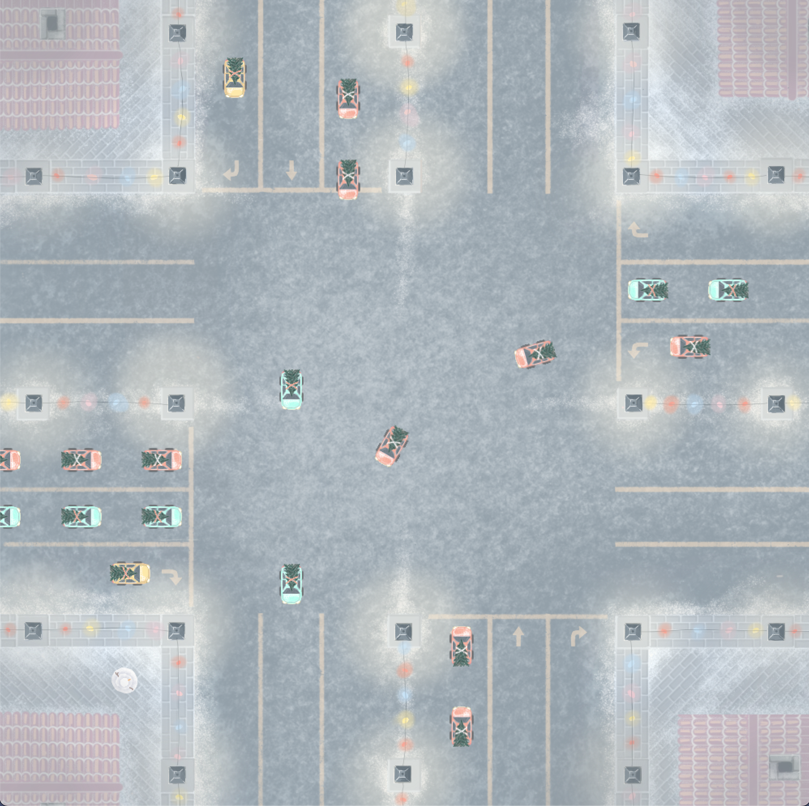
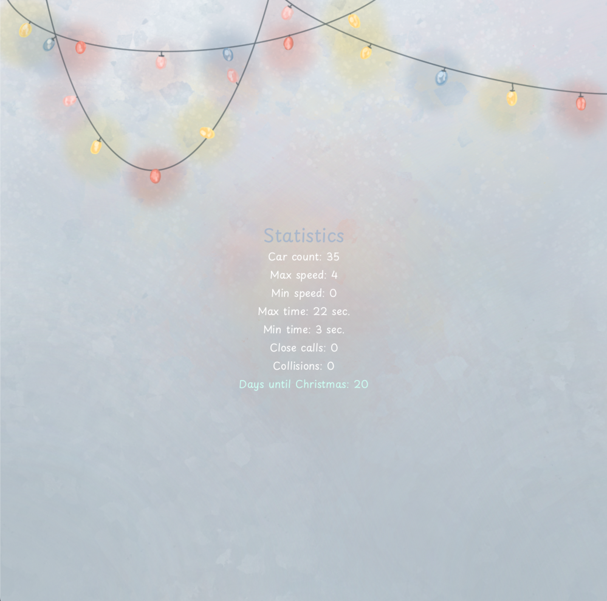

# smart-road
Authors: [Natalia Kim](https://github.com/nattikim), [Maxim Mikhailov](https://github.com/maximihajlov)

A smart road simulation using the Rust programming language and the Macroquad library. 
The project aims to design a new traffic strategy algorithm for autonomous vehicles (AVs) 
to pass an intersection without collisions and with minimal congestion.

The project was implemented as a part of the Grit:lab coding school curriculum (01Edu platform), December 2023.

**[Task description and audit questions](https://github.com/01-edu/public/tree/master/subjects/smart-road)**

## How to run

`cargo build --release`

`cargo run --release`

## Usage

### To generate vehicle:

Press ⬇️ button to generate vehicle with **North-South** starting vector\
Press ⬅️ button to generate vehicle with **East-West** starting vector\
Press ⬆️ button to generate vehicle with **North-South** ending vector\
Press ➡️ button to generate vehicle with **East-West** ending vector

or 

Press **R** to generate a random vehicle with a random route

### To see the statistics:

Press **P** 

### To exit:

Press **ESC**

## Sneak peek

